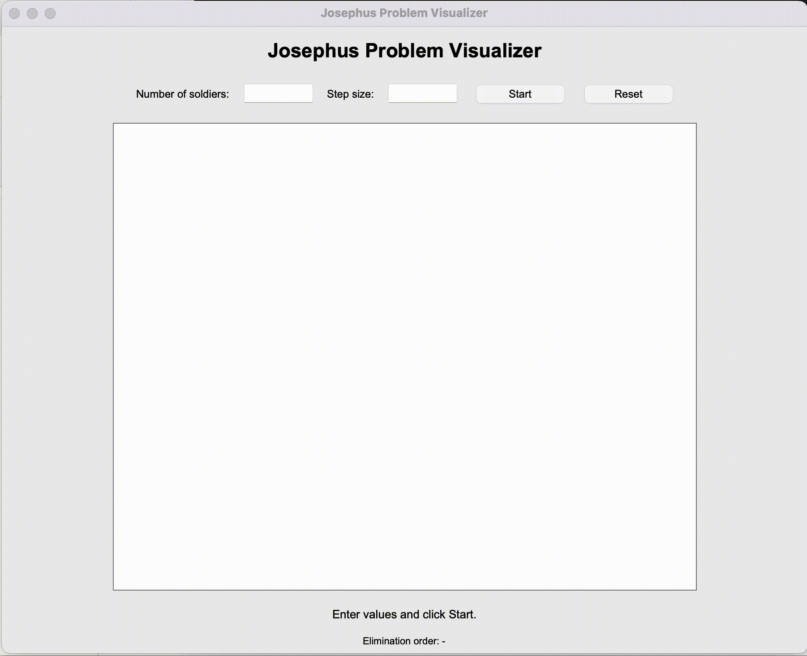

# Josephus Problem Visualizer

An interactive Python GUI application that visualizes the classic **Josephus Problem** using **Tkinter**.

## Demo



## Overview

The Josephus Problem is a classic counting-out problem where `n` people stand in a circle and every `k`-th person is eliminated until only one survivor remains.

This project demonstrates the algorithm visually by placing soldiers around a circle and animating the elimination process step by step. It is designed as an educational project to show how modular arithmetic, list manipulation, and GUI animation can work together in Python.

## Features

- Interactive GUI built with Tkinter
- Input fields for the number of soldiers and step size
- Circular visualization of all soldiers
- Step-by-step animated elimination process
- Eliminated soldiers visually updated during the simulation
- Final survivor highlighted at the end
- Elimination order displayed in real time
- Input validation for invalid or missing values
- Clean separation between algorithm logic and GUI code

## Technologies Used

- Python
- Tkinter
- Math module

## Project Structure

```text
josephus-visualizer/
├── main.py
├── josephus.py
├── gui.py
├── README.md
├── requirements.txt
├── assets/
│   └── demo.gif
└── .gitignore
```

## How to Run

Clone the repository:

```bash
git clone https://github.com/YOUR-USERNAME/josephus-visualizer.git
cd josephus-visualizer
```

Run the application:

```bash
python main.py
```

On some systems, you may need to use:

```bash
python3 main.py
```

## Example

Input:

```text
Number of soldiers: 7
Step size: 3
```

The program eliminates every third soldier until only one survivor remains.

Example elimination order:

```text
3, 6, 2, 7, 5, 1
```

Survivor:

```text
4
```

## Why This Project Matters

This project is a visual demonstration of an algorithmic problem that is often taught in computer science and discrete mathematics. Instead of only printing the result, the GUI helps users understand how the elimination process works step by step.

It shows practical use of:

- Modular arithmetic
- List indexing
- Algorithm simulation
- GUI design
- Event-driven programming
- Visual feedback for user interaction

## What I Learned

Through this project, I practiced:

- Implementing the Josephus algorithm
- Working with lists and circular indexing
- Building a GUI with Tkinter
- Drawing and animating objects on a canvas
- Separating application logic from user interface code
- Handling invalid user input
- Preparing a Python project for GitHub presentation

## Future Improvements

- Add a speed control slider
- Add pause and resume buttons
- Export elimination order to a file
- Add unit tests for the algorithm
- Improve the visual design
- Add dark mode
- Allow users to save the animation result

## License

This project is intended for educational and portfolio purposes.
